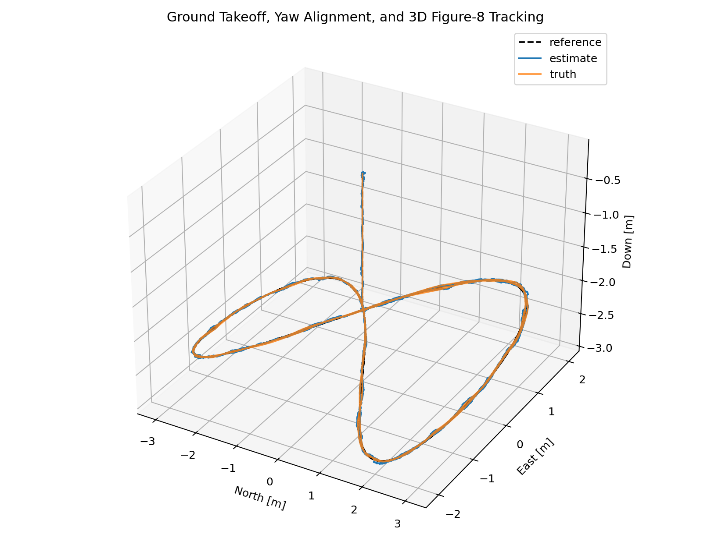
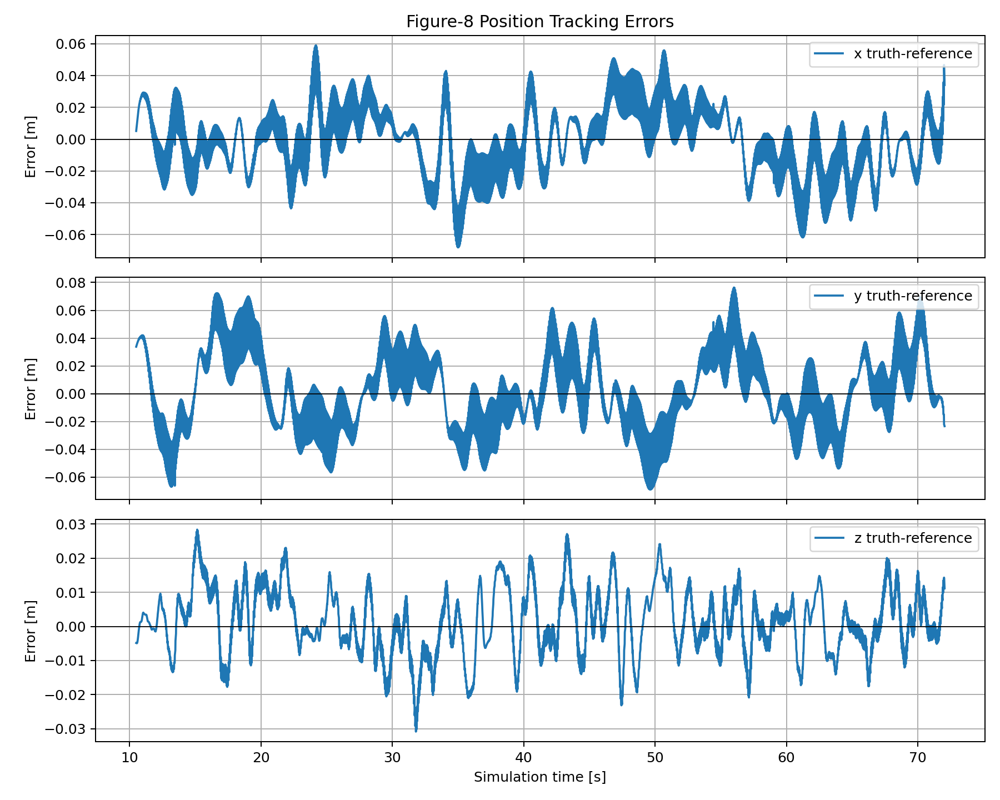
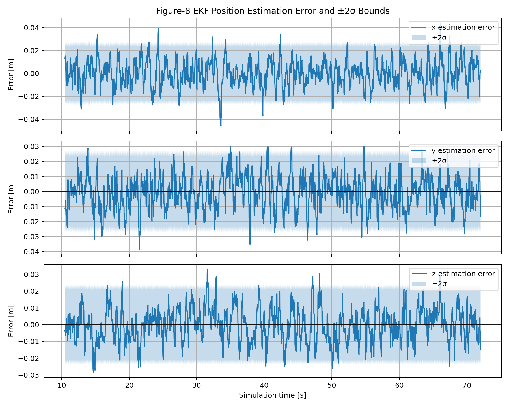
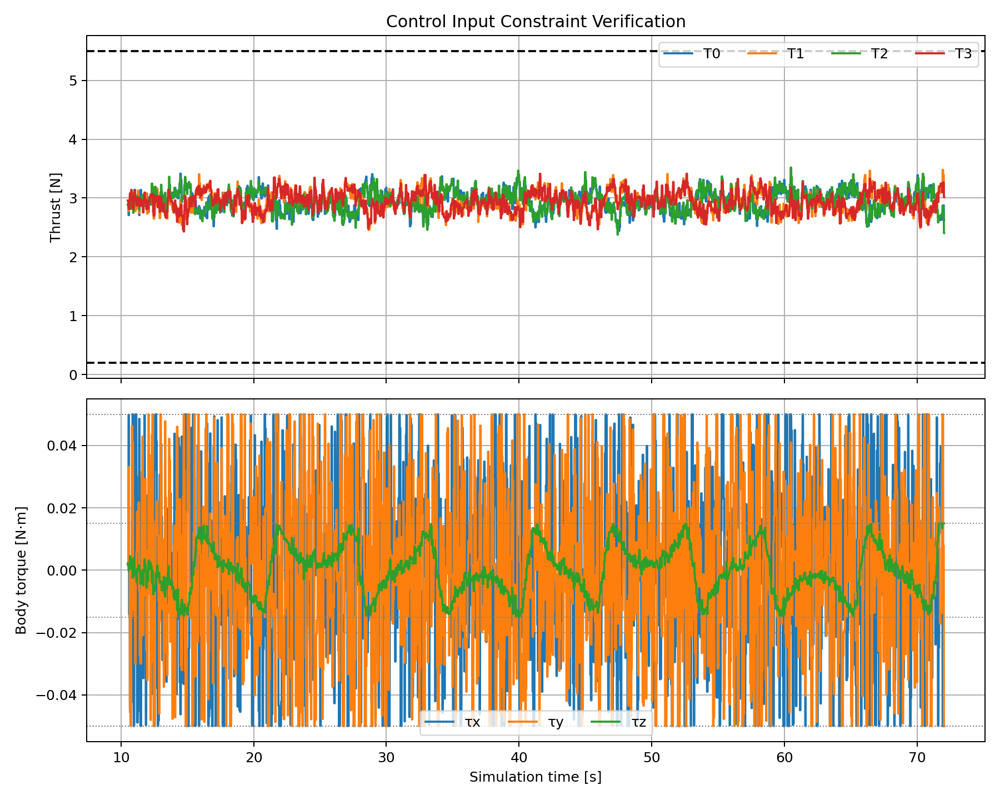
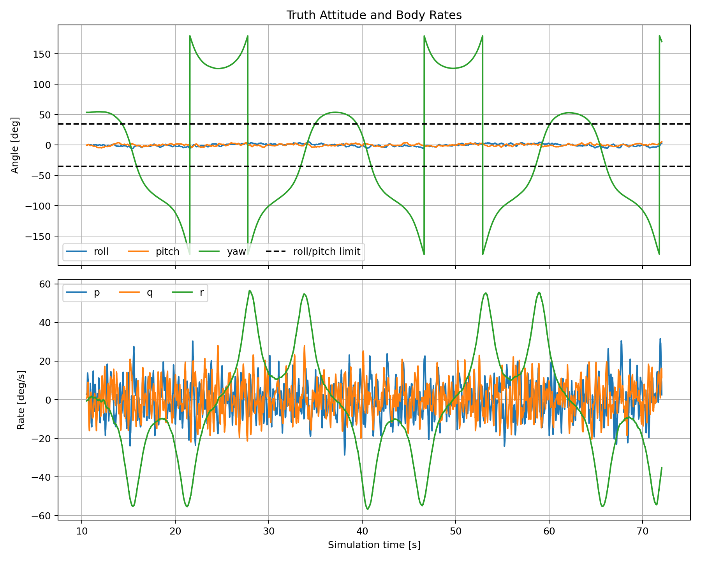
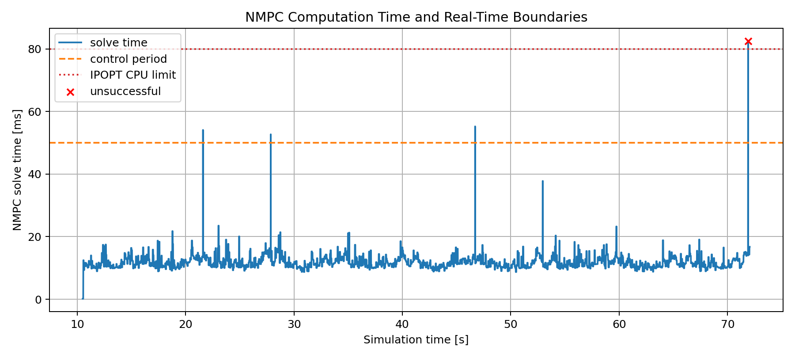

# 四旋翼 EKF-NMPC 三维八字轨迹跟踪验收报告

## 1. 报告摘要

本项目在 ROS 2 Jazzy 与 Gazebo Harmonic 中实现了一套不依赖 PX4 或现成飞控动力学的
四旋翼闭环仿真系统。系统使用自行建立的 13 维刚体动力学、与车辆状态完全对齐的
13 维扩展卡尔曼滤波器（EKF）、基于 CasADi/IPOPT 的非线性模型预测控制器（NMPC）
以及 Gazebo 物理仿真完成以下任务：

1. 飞行器从地面附近垂直起飞至 NED 坐标 $(0,0,-2.0)$ m；
2. 在定点阶段将 yaw 对准八字轨迹的初始切向方向 $53.13^\circ$；
3. 状态连续稳定后进入解析三维八字，并以平滑时间参数化消除入口速度阶跃；
4. 在有 IMU 与 GNSS 白噪声的条件下，由 EKF 提供 13 维状态估计并由 NMPC 闭环跟踪；
5. 记录参考、真值、估计、控制输入、约束和求解器性能，生成可复核的图片与 CSV 日志。

最终验收运行共记录 9285 个样本，仿真时长 92.85 s。八字阶段的三维位置跟踪 RMSE 为
0.0356 m，入口前 5 s 的三维 RMSE 为 0.0370 m、最大误差为 0.0687 m。八字阶段内
旋翼推力、机体力矩、倾角和机体系角速度均无约束越界。NMPC 日志样本成功率为
99.9838%，中位求解时间为 11.43 ms，P95 为 15.62 ms。

> 本报告根据课程 rubric 整理技术内容、方法、图表和仿真证据。rubric 中的现场展示、
> 三人分工、口头问答和团队系数不属于代码或离线日志能够验证的范围，因此本报告不对这些
> 项目自评打分，也不虚构数值及格线。

## 2. Rubric 验收证据映射

| Rubric 关注点 | 本报告证据 | 原始文件 |
|---|---|---|
| 非线性四旋翼运动学与四元数 | 第 4 节 | `dynamics.py`、`nmpc.py` |
| 连续-离散 13 维 EKF 与噪声协方差 | 第 5 节与图 3 | `ekf.py`、`project.yaml` |
| NMPC 代价、RK4 与原生约束 | 第 7 节 | `nmpc.py`、`project.yaml` |
| 三维八字轨迹跟踪 | 第 9.1 节与图 1 | `trajectory_3d.png` |
| 跟踪误差 | 第 9.2 节与图 2 | `tracking_errors.png` |
| EKF $\pm2\sigma$ 一致性 | 第 9.3 节与图 3 | `ekf_position_error_2sigma.png` |
| 推力、力矩、倾角与角速度约束 | 第 9.4-9.5 节与图 4-5 | `control_constraints.png`、`attitude_rates.png` |
| 求解耗时及实时边界 | 第 9.6 节与图 6 | `solver_time.png` |
| 完整闭环仿真和可复现代码 | 第 3、8、11 节 | Docker、ROS 2 launch、CSV 日志 |

## 3. 系统架构与运行环境

### 3.1 软件环境

| 组件 | 使用版本或方案 |
|---|---|
| 操作系统环境 | Docker 容器 |
| 中间件 | ROS 2 Jazzy |
| 物理仿真 | Gazebo Harmonic |
| 数值计算 | Python、NumPy |
| 非线性优化 | CasADi + IPOPT |
| 数据处理与绘图 | pandas + Matplotlib |

### 3.2 闭环数据流

```text
Gazebo rigid body + custom rotor wrench plugin
        |
        +--> ideal IMU/NavSat/odometry
                  |
                  v
        SensorSimulatorNode -- noisy IMU/GNSS --> 13-state EKF
                                                       |
                                                       v
TrajectoryNode --> reference horizon --> NMPC <-- estimated State13
                                            |
                                            v
                              four rotor thrust commands
                                            |
                                            v
                                   Gazebo dynamics
                                            |
                                            +--> logger / plots
```

Gazebo 使用 ENU 世界系和 FLU 机体系，GNC 内部统一采用 NED 世界系和 FRD 机体系。
所有向量和姿态在进入估计器与控制器前进行显式坐标变换。控制器对外状态为

$$
\mathbf x=
\begin{bmatrix}
x&y&z&u&v&w&q_w&q_x&q_y&q_z&p&q&r
\end{bmatrix}^T\in\mathbb R^{13}.
$$

四元数采用 Hamilton 约定并表示 body-to-world 旋转。积分和优化过程中持续归一化四元数，
避免单位范数数值漂移。

## 4. 独立四旋翼动力学模型

### 4.1 物理参数

动力学未调用 PX4 或 Gazebo 内置多旋翼动力学。项目仅使用题目允许的飞行器物理参数，
自行建立推力、力矩和刚体方程。

| 参数 | 数值 |
|---|---:|
| 质量 $m$ | 1.20 kg |
| 力臂 $d_x,d_y$ | 0.225 m |
| 惯量 $J$ | $\operatorname{diag}(0.0125,0.0125,0.0220)$ kg m$^2$ |
| 反扭矩比 $c_\tau$ | 0.015 m |
| 重力 $g$ | 9.81 m/s$^2$ |
| 单旋翼推力范围 | $[0.2,5.5]$ N |

水平悬停时单旋翼推力为

$$
T_h=\frac{mg}{4}=2.943\ \mathrm N.
$$

### 4.2 推力与力矩映射

FRD 机体系的 z 轴向下，旋翼合力方向向上，因此

$$
\mathbf F_T^B=
\begin{bmatrix}0&0&-\sum_{i=0}^{3}T_i\end{bmatrix}^T.
$$

X 构型四旋翼的力矩由四个旋翼推力直接计算：

$$
\boldsymbol\tau^B=
\begin{bmatrix}
d_y(-T_0-T_1+T_2+T_3)\\
d_x(-T_0+T_1+T_2-T_3)\\
c_\tau(-T_0+T_1-T_2+T_3)
\end{bmatrix}.
$$

### 4.3 13 维连续模型与离散化

完整连续动力学为

$$
\dot{\mathbf p}^W=\mathbf v^W,
$$

$$
\dot{\mathbf v}^W=\mathbf g^W+
\frac{1}{m}R_{WB}(q)\mathbf F_T^B,
$$

$$
\dot q^{WB}=\frac12q^{WB}\otimes
\begin{bmatrix}0&(\boldsymbol\omega^B)^T\end{bmatrix}^T,
$$

$$
\dot{\boldsymbol\omega}^B=J^{-1}
\left(\boldsymbol\tau^B-
\boldsymbol\omega^B\times J\boldsymbol\omega^B\right).
$$

NMPC 内部使用相同模型并通过 RK4 以 $\Delta t=0.05$ s 离散化。Gazebo 侧的
`RotorWrenchSystem` 只实现上述力/力矩映射，不调用 `MulticopterMotorModel`。

## 5. 传感器与 EKF

### 5.1 传感器模型

| 传感器 | 频率 | 白噪声标准差 |
|---|---:|---:|
| 加速度计 | 100 Hz | $0.08$ m/s$^2$ |
| 陀螺仪 | 100 Hz | $0.015$ rad/s |
| GNSS 位置 | 20 Hz | $0.02$ m |

IMU 模型为

$$
\mathbf f_m^B=R_{WB}^T(\mathbf a^W-\mathbf g^W)+\mathbf n_a,
$$

$$
\boldsymbol\omega_m^B=\boldsymbol\omega^B+\mathbf n_g.
$$

本次验收直接忽略 IMU bias，即

$$
\mathbf b_a\equiv\mathbf0,\qquad \mathbf b_g\equiv\mathbf0.
$$

传感器仿真只加入题目指定的白噪声，不生成 bias 或随机游走；EKF 也不包含 bias 状态。
因此这是一个“无 bias 模型”，而不是“包含零值 bias 状态的模型”。该选择使 EKF 与
车辆状态严格对齐为 13 维，但不具备真实硬件零偏估计能力，也不覆盖 rubric 最高档中
关于 bias estimation 的要求。

### 5.2 13 维 EKF 状态

EKF 状态为

$$
\mathbf x_E=
\begin{bmatrix}
\mathbf p^W&\mathbf v^W&q^{WB}&\boldsymbol\omega^B
\end{bmatrix}^T\in\mathbb R^{13}.
$$

EKF 内部状态、$13\times13$ 协方差、ROS `State13` 消息和 NMPC 输入均采用相同排列，
不存在额外状态或输出裁剪。

### 5.3 连续-离散预测和 GNSS 更新

因为 bias 不在模型中，IMU 预测直接使用带白噪声的 specific force 与 gyro：

$$
\hat{\mathbf a}^W=R_{WB}(\hat q)\mathbf f_m^B+\mathbf g^W,
\qquad
\boldsymbol\omega_{k+1}=\boldsymbol\omega_{m,k}.
$$

随后使用定加速度和一阶角增量传播位置、速度与四元数。离散状态转移 Jacobian
$F_k$ 通过中心差分计算，协方差预测为

$$
P_{k+1}^-=F_kP_k^+F_k^T+Q_k.
$$

当前稳定性测试恢复原始经验对角过程噪声：

$$
Q_k=\operatorname{diag}\left(
10^{-8}I_3,\sigma_a^2I_3,\frac14\sigma_g^2I_4,\sigma_g^2I_3
\right)\Delta t.
$$

该简单模型不显式保留过程噪声交叉项。WGS84 坐标尺度修正继续保留。

GNSS 位置观测矩阵为 $H=[I_3\ 0_{3\times10}]$，测量协方差为
$R_p=\sigma_p^2I_3$。更新使用 Joseph form：

$$
P_k^+=(I-KH)P_k^-(I-KH)^T+KR_pK^T,
$$

并在每次更新后进行协方差对称化与最小特征值正则化。

## 6. 任务与三维八字轨迹

### 6.1 三阶段任务

| 阶段 | 时间 | 动作 |
|---|---:|---|
| 垂直起飞 | 0-5 s | 从 $z=-0.035$ m 上升到 $z=-2.0$ m |
| yaw 对准与状态确认 | 5-10.51 s | 对准 $53.13^\circ$，并等待状态稳定 0.5 s |
| 三维八字 | 10.51-72.04 s | 解析八字空间路径和 3 s 相位速度渐入 |

起飞和 yaw 对准使用五次多项式满足端点约束；八字本体不拟合新的空间过渡曲线。进入八字
前检查位置、速度、yaw 和角速度，连续满足阈值 0.5 s 后才释放任务时钟。

### 6.2 八字解析轨迹

以进入八字后的局部时间 $t_f$ 表示：

$$
x_r=A_x\sin(\omega t_f),\qquad
y_r=A_y\sin(2\omega t_f),
$$

$$
z_r=z_0+A_z\cos(\omega t_f),
$$

其中

$$
A_x=3\ \mathrm m,\quad A_y=2\ \mathrm m,\quad
A_z=0.5\ \mathrm m,\quad z_0=-2.5\ \mathrm m,
\quad\omega=0.25\ \mathrm{rad/s}.
$$

八字起点为

$$
\mathbf p_r(0)=[0,0,z_0+A_z]^T=[0,0,-2.0]^T\ \mathrm m.
$$

参考速度、加速度和 yaw-rate 均由位置公式解析求导，避免数值差分噪声。数学轨迹周期为

$$
T=\frac{2\pi}{\omega}=25.1327\ \mathrm s.
$$

因此每个数学周期后返回相同的状态。当前验收八字阶段持续 60 s，相当于约 2.387 个周期，
所以 60 s 阶段终点不等于单周期起点。

八字入口采用半余弦相位速度渐入。空间轨迹仍按上述解析公式计算，但 $\dot t_f$ 从 0
连续增加到 1，且入口两端的相位加速度均为 0。因此位置、速度和加速度连续，同时避免
重新拟合八字几何形状。

## 7. NMPC 设计

### 7.1 优化问题

控制输入为四个旋翼推力

$$
\mathbf u_k=[T_{0,k},T_{1,k},T_{2,k},T_{3,k}]^T.
$$

控制器采用 multiple shooting：

$$
\min_{\mathbf X,\mathbf U}
\sum_{k=0}^{N-1}\ell(\mathbf x_k,\mathbf u_k,\mathbf x_{r,k})
+\ell_f(\mathbf x_N,\mathbf x_{r,N}),
$$

$$
\text{s.t.}\quad
\mathbf x_0=\hat{\mathbf x},\qquad
\mathbf x_{k+1}=f_d(\mathbf x_k,\mathbf u_k).
$$

当前 $N=12$、$\Delta t=0.05$ s，预测时域为 0.6 s，控制频率为 20 Hz。

### 7.2 代价函数

阶段代价同时惩罚位置、速度、姿态、机体系角速度和相对悬停输入：

$$
\ell=
\mathbf e_p^TQ_p\mathbf e_p+
\mathbf e_v^TQ_v\mathbf e_v+
w_q\left[1-(q^Tq_r)^2\right]+
\mathbf e_\omega^TQ_\omega\mathbf e_\omega+
(\mathbf u-\mathbf u_h)^TR(\mathbf u-\mathbf u_h).
$$

其中

$$
Q_p=\operatorname{diag}(20,20,25),\quad
Q_v=\operatorname{diag}(4,4,5),
$$

$$
w_q=12,\quad
Q_\omega=\operatorname{diag}(2,2,0.5),\quad
R=0.1I_4.
$$

终端代价使用 4 倍阶段权重。姿态项对 $q$ 与 $-q$ 不敏感。

### 7.3 原生约束与安全投影

NMPC 预测域中显式施加：

| 约束 | 边界 |
|---|---:|
| 单旋翼推力 | $0.2\le T_i\le5.5$ N |
| roll/pitch | $|\phi|,|\theta|\le35^\circ$ |
| body rate | $|p|,|q|\le180^\circ$/s，$|r|\le90^\circ$/s |
| roll/pitch 力矩 | $|\tau_x|,|\tau_y|\le0.05$ N m |
| yaw 力矩 | $|\tau_z|\le0.015$ N m |
| 相邻旋翼推力 | $|T_{i,k}-T_{i,k-1}|\le2.0$ N/step |

上一周期实际发布推力作为 NLP 参数，首个预测控制量及预测域内所有相邻控制量均直接满足
40 N/s/rotor 的变化率限制。控制输出发布前仍经过同样的安全投影，作为回退控制和数值
误差的最后保护。

### 7.4 求解器与回退策略

IPOPT 最大迭代次数为 80，CPU 时间上限为 80 ms，容差为 $10^{-4}$。成功解作为下一周期
warm start；状态和控制预测序列向前 shift 一步，末端状态再传播一步，末端控制保持最后值。

若 IPOPT 失败、超时或安全恢复状态被触发，系统采用几何回退控制，并在发布前执行同一套
执行器安全投影。该设计使短时求解失败不会直接导致推力命令丢失。

## 8. 验收试验与数据处理

### 8.1 试验条件

- Docker 中运行 ROS 2 Jazzy 与 Gazebo Harmonic；
- Gazebo 使用项目自定义 rotor wrench 插件；
- IMU 与 GNSS 白噪声保持启用，随机种子为 6224；
- 传感器与 EKF 均不建模 IMU bias，只考虑指定白噪声；
- 运行完整起飞、yaw 对准、状态门控与 60 s 八字路径时间；
- 图表按日志中的有效任务时间识别八字阶段，最终释放时刻为 10.51 s；
- 原始日志以约 100 Hz 保存，最终运行记录到 92.85 s。

### 8.2 输出文件

- [原始飞行日志](../results/flight_log.csv)
- [逐时刻验收日志](../results/acceptance_log.csv)
- [文本指标汇总](../results/acceptance_summary.txt)
- [CSV 指标汇总](../results/acceptance_summary.csv)

`acceptance_log.csv` 包含时间、任务阶段、参考/真值/估计坐标、跟踪误差、估计误差、
姿态、航向误差、四旋翼推力、三轴力矩以及求解器耗时、迭代次数、成功标志和状态字符串。

## 9. 验收结果与分析

### 9.1 三维轨迹



**图 1：地面起飞、yaw 对准和三维八字轨迹。** 黑色虚线为参考轨迹，蓝色为 EKF 估计，
橙色为 Gazebo 真值。三条曲线在八字主体内高度重合，且图中可以看到从地面附近到
$z=-2.0$ m 的垂直起飞段。

### 9.2 位置跟踪误差



**图 2：八字阶段真值相对参考的位置误差。**

| 指标 | X | Y | Z | 三维范数 |
|---|---:|---:|---:|---:|
| 八字全阶段 RMSE | 0.0207 m | 0.0273 m | 0.0097 m | 0.0356 m |
| 八字全阶段最大绝对值/范数 | 0.0682 m | 0.0764 m | 0.0309 m | 0.0808 m |
| 入口 5 s RMSE | 0.0181 m | 0.0307 m | 0.0098 m | 0.0370 m |
| 入口 5 s 最大三维误差 | - | - | - | 0.0687 m |
| 入口后稳态 RMSE | 0.0210 m | 0.0270 m | 0.0097 m | 0.0355 m |

修改前入口速度阶跃产生 0.5849 m 最大三维误差和 0.2369 m 的入口 5 s RMSE。平滑相位
渐入后分别降为 0.0687 m 和 0.0370 m；入口 RMSE 与后续稳态 0.0355 m 基本一致，说明
原有可见瞬态已经消除。

八字阶段航向 RMSE 为 $1.675^\circ$。高度方向 RMSE 为 0.0097 m，明显小于水平误差，
表明垂向跟踪和重力补偿稳定。

### 9.3 EKF 估计误差与一致性



**图 3：八字阶段 EKF 位置估计误差及 $\pm2\sigma$ 边界。**

| 轴 | 位置 RMSE | $\pm2\sigma$ 覆盖率 |
|---|---:|---:|
| X | 0.01115 m | 97.58% |
| Y | 0.01095 m | 97.56% |
| Z | 0.00987 m | 97.84% |

三个方向的估计曲线均未发散。保留 WGS84 修正并恢复简单对角过程噪声后，三轴 RMSE
均约为 1 cm，$\pm2\sigma$ 覆盖率均在 97.5%～97.9%。单次固定随机种子结果略偏保守，
但表明简单过程噪声在当前仿真中保持稳定；严格一致性仍需多随机种子试验。

### 9.4 旋翼推力与力矩约束



**图 4：八字阶段四旋翼推力和三轴机体力矩。**

| 约束指标 | 实测最大/最小 | 边界 | 越界样本 |
|---|---:|---:|---:|
| 最小旋翼推力 | 2.3776 N | $\ge0.2$ N | 0 |
| 最大旋翼推力 | 3.5176 N | $\le5.5$ N | 0 |
| 最大相邻推力变化 | 0.4689 N/step | $\le2.0$ N/step | 0 |
| $|\tau_x|$ | 0.0500 N m | $\le0.05$ N m | 0 |
| $|\tau_y|$ | 0.0500 N m | $\le0.05$ N m | 0 |
| $|\tau_z|$ | 0.0150 N m | $\le0.015$ N m | 0 |

旋翼推力距离上限仍有 1.9824 N 裕度，距离下限有 2.1776 N 裕度。实际最大相邻命令变化
为 0.4689 N，低于预测约束的 2.0 N/step。三轴力矩多次接近
配置边界，说明控制器在入口瞬态和曲率变化处积极使用可用力矩；但所有样本仍满足边界。
力矩边界裕度较小，是后续平滑控制和降低 chattering 时需要关注的项目。

### 9.5 姿态和机体系角速度



**图 5：八字阶段真值姿态与机体系角速度。** yaw 使用 $[-180^\circ,180^\circ]$ 表示，
图中的垂直跳变是角度 wrap，不是飞行器瞬间旋转。

| 指标 | 实测最大值 | 约束 | 剩余裕度 | 越界样本 |
|---|---:|---:|---:|---:|
| 倾角 $\max(|\phi|,|\theta|)$ | 5.73° | 35° | 29.27° | 0 |
| $|p|$ | 31.64°/s | 180°/s | 148.36°/s | 0 |
| $|q|$ | 28.12°/s | 180°/s | 151.88°/s | 0 |
| $|r|$ | 56.72°/s | 90°/s | 33.28°/s | 0 |

姿态和角速度均保留明确裕度。用于验收统计的 ground-truth 角速度来自 Gazebo 原始无噪声
IMU，而不是 `OdometryPublisher` 偶发的 heading-wrap twist 毛刺。

### 9.6 NMPC 求解时间



**图 6：八字阶段 NMPC 求解耗时。** 橙色虚线为 20 Hz 控制周期 50 ms，红色点线为
IPOPT CPU 时间上限 80 ms，红色叉号表示未成功样本。

| 指标 | 结果 |
|---|---:|
| 日志样本成功率 | 99.9838% |
| 中位求解时间 | 11.43 ms |
| P95 求解时间 | 15.62 ms |
| 最大求解时间 | 82.57 ms |
| 超过 50 ms 控制周期的样本 | 4 |
| 未成功求解样本 | 1 |

绝大多数求解在 20 ms 内完成，满足 50 ms 控制周期；但仍有 4 个日志样本超过控制周期，
最大值也略超 80 ms 的 IPOPT CPU 设置。系统在这些时刻自动使用几何回退控制，轨迹没有
发散，说明闭环具备短时 solver failure 容错能力。严格实时性仍不能仅凭平均值宣称满足：
可进一步缩短或自适应预测域、优化 CasADi 图和 IPOPT 选项，
或改用实时迭代型求解器。

## 10. 综合验收结论

### 10.1 已验证项目

- 自行建立并在 Gazebo 中执行 13 维四旋翼非线性动力学；
- ROS 2 中的传感器、EKF、轨迹、NMPC、执行器与日志节点构成完整闭环；
- EKF 状态与控制器状态完全一致，均为 13 维；
- IMU bias 被明确忽略，同时保留题目要求的白噪声；
- 完成地面起飞、yaw 对准和三维八字跟踪；
- 八字稳态跟踪误差小，未观察到长期漂移；
- 推力、力矩、倾角和角速度约束均无越界；
- NMPC 在绝大多数样本中满足控制周期，偶发超时时安全回退；
- Docker 构建成功，24 项自动化测试全部通过。

### 10.2 当前限制

1. 当前简单对角 $Q_k$ 不显式表达位置—速度和姿态—角速度的过程噪声相关性。
2. 当前三轴覆盖率略高于理论 95%，单次随机种子不能证明统计一致性。
3. 三轴力矩经常接近限制，虽然未越界，但控制平滑性仍有提升空间。
4. NMPC 存在少量超过 50 ms 控制周期的样本，尚不能称为硬实时保证。
5. 模型未包含气动阻力、风扰动和电机一阶动态。
6. 13 维 EKF 不估计 IMU bias，因此无法补偿真实硬件的慢变零偏，也不满足 rubric
   最高档对 bias estimation 的完整要求。

### 10.3 改进落实情况

1. 已保留 WGS84 坐标修正，并为稳定性对照恢复简单经验对角 $Q_k$；
2. 已实现 NMPC receding-horizon shifted warm start；
3. 已使用位置、速度、yaw、角速度和 0.5 s 驻留时间决定八字入口；
4. 已将首步和预测域内的推力变化率约束直接加入 NLP；
5. 风扰动、参数不确定性和 Monte Carlo 试验仍作为后续鲁棒性评估工作。

## 11. 复现步骤

### 11.1 构建与测试

```bash
cd /absolute/path/to/drone
docker compose build
docker compose run --rm drone-dev bash -lc \
  './scripts/build_workspace.sh && python3 -m pytest -q src/drone_gnc/test'
```

预期测试结果：

```text
24 passed
```

### 11.2 带 Gazebo GUI 的演示

```bash
cd /absolute/path/to/drone
./scripts/run_simulation.sh
```

默认启用 Gazebo 内的参考轨迹和实际轨迹标记。

### 11.3 无界面验收运行

```bash
docker compose run --rm drone-dev bash -lc '
source /opt/ros/jazzy/setup.bash
source /opt/drone_venv/bin/activate
source install/setup.bash
ros2 launch drone_gazebo simulation.launch.py gui:=false show_trajectory:=false
'
```

八字任务在仿真时间 70 s 完成，可在此后按 `Ctrl+C` 停止。

### 11.4 重新生成图片与验收日志

```bash
docker compose run --rm drone-dev python3 scripts/generate_plots.py
```

新仿真会覆盖 `results/flight_log.csv`，需要保留某次验收数据时应先复制或重命名该文件。

## 12. 代码与推导索引

- [坐标系、状态和四元数](01_frames_and_state.md)
- [四旋翼动力学与执行器映射](02_quadrotor_dynamics.md)
- [传感器模型与 EKF](03_sensor_and_ekf.md)
- [任务阶段与三维八字](04_trajectory_generation.md)
- [NMPC 与安全回退](05_nmpc_and_fallback.md)
- [参数与实现追溯](06_parameter_traceability.md)
- [项目运行说明](../README.md)
